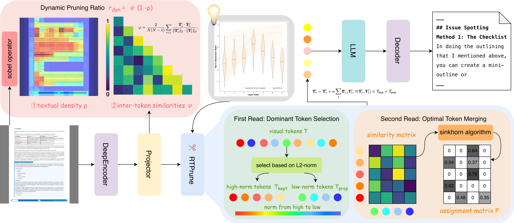
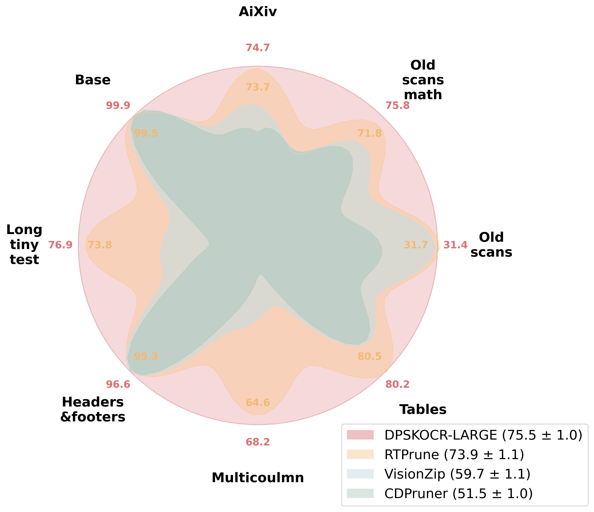
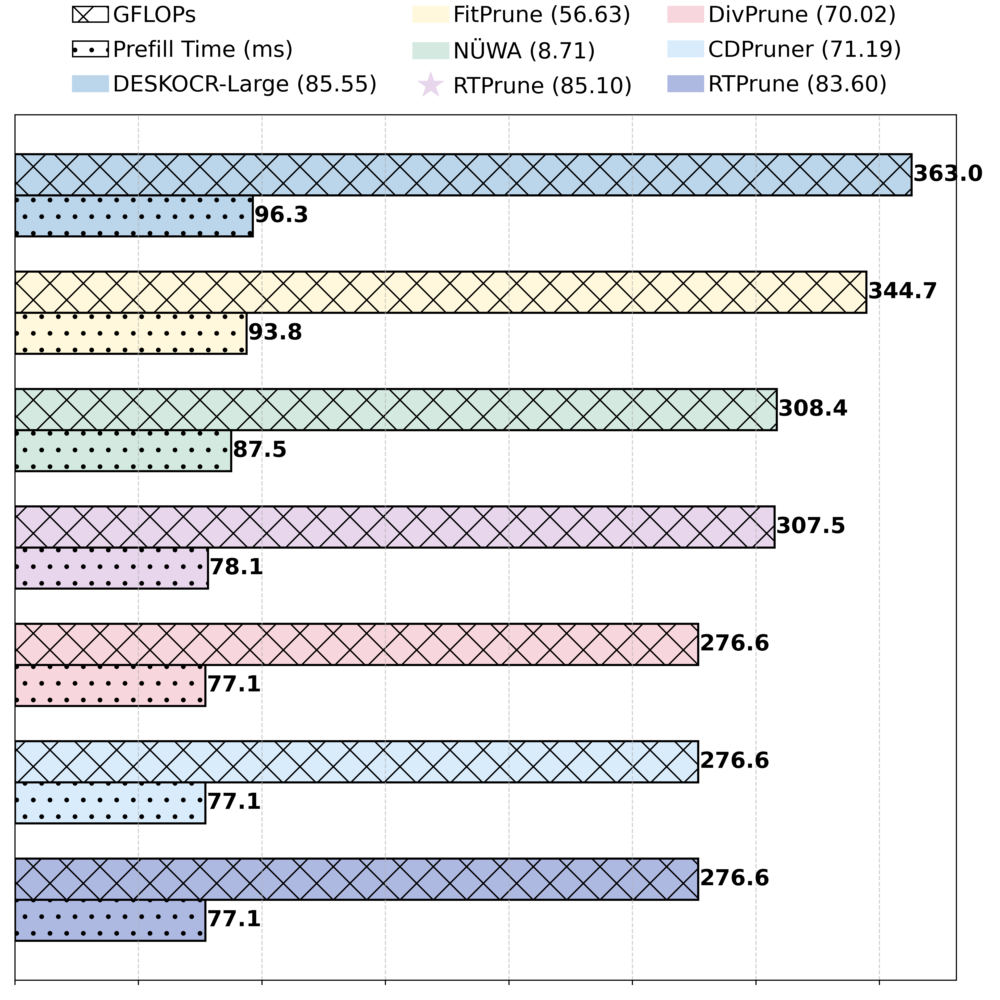

# RTPrune: Reading-Twice Inspired Token Pruning for Efficient DeepSeek-OCR Inference

RTPrune is a two-stage, training-free visual token pruning framework for DeepSeek-OCR that mimics the LLM’s reading-twice behavior and adopts a dynamic pruning ratio, achieving efficient inference while preserving high OCR accuracy.

<p align="center" width="100%">

</p>

## Highlights

<p align="center">
  
  
</p>

1. Our RTPrune consistently outperforms prior token pruning methods on DeepSeek-OCR, retaining over 97.88\% of accuracy with 84\% of visual tokens on olmOCR-Bench. 
2. Our RTPrune reduces GFLOPs by nearly 15.29\% and prefill time by nearly 18.90\% on OmniDocBench when maintaining 99.47\% accuracy.

## Installation

1. Install the [DeepSeek-OCR](https://github.com/deepseek-ai/DeepSeek-OCR) environment.

2. Download the ckpt files from [huggingface](https://huggingface.co/deepseek-ai/DeepSeek-OCR) and put them in ./DeepSeek-OCR/DeepSeek-OCR-master/DeepSeek-OCR-ckpt.

3. Replace the corresponding files or add new files with our [code](./DeepSeek-OCR/DeepSeek-OCR-master/DeepSeek-OCR-ckpt) and the added part can be searched by "\[modified\]".

## Quick Start

Run the following command:
```
cd dpsk-ocr-token-pruning/DeepSeek-OCR/DeepSeek-OCR-master/DeepSeek-OCR-hf
python run_dpsk_ocr.py
```


## Evaluation

- The evaluation code follows the pipeline of [OmniDocBench](https://github.com/opendatalab/OmniDocBench?tab=readme-ov-file), [olmOCR-Bench](https://github.com/allenai/olmocr/tree/main/olmocr/bench) and [Ocean-OCR Benchmark](https://github.com/guoxy25/Ocean-OCR?tab=readme-ov-file).

- The evaluation for prefilling time and decoding time is provided in our [code](./DeepSeek-OCR/DeepSeek-OCR-master/DeepSeek-OCR-ckpt/modeling_deepseekv2.py).

- We also provide the implementations of [VisionZip](https://github.com/dvlab-research/VisionZip), [DivPrune](https://github.com/vbdi/divprune) and [CDPruner](https://github.com/Theia-4869/CDPruner) on DeepSeek-OCR.

## Acknowledgement
- This work is built upon [DeepSeek-OCR](https://github.com/deepseek-ai/DeepSeek-OCR). We thank them for their excellent open-source contributions.

- We also thank [VisionZip](https://github.com/dvlab-research/VisionZip), [DivPrune](https://github.com/vbdi/divprune), [CDPruner](https://github.com/Theia-4869/CDPruner), and others for their contributions, which have provided valuable insights.

## License
- RTPrune is licensed under the Apache License 2.0. 